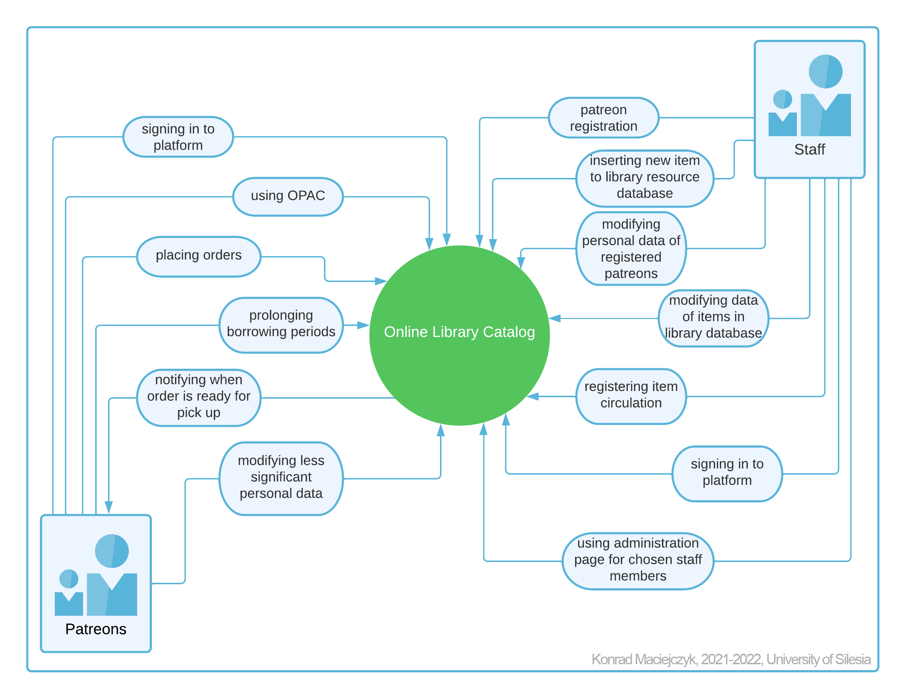
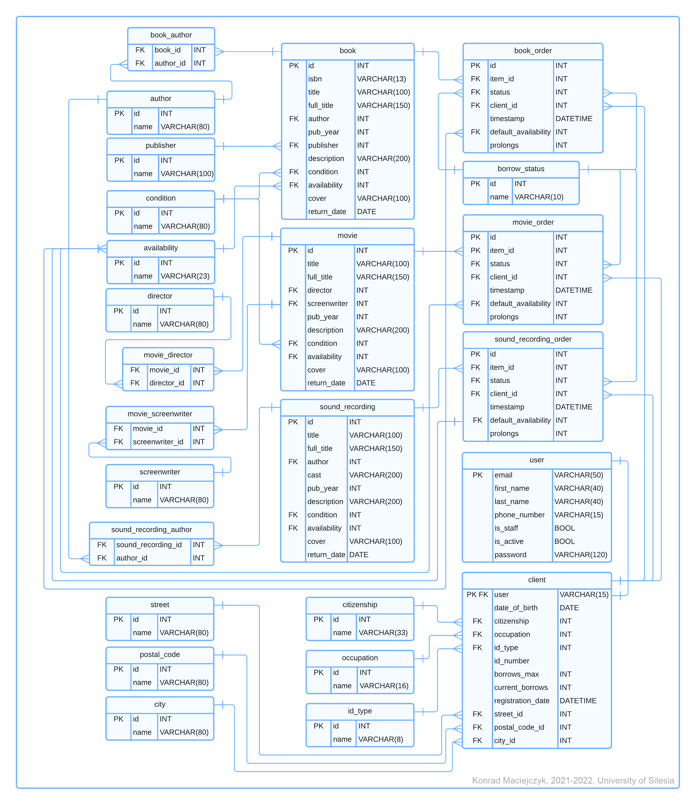

# Integrated Library System - Django web application
## Table of contents
* &ensp;&ensp;[What are Integrated Library Systems (ILS)?](#about-ils)
* &ensp;&ensp;[Online demo version](#online-demo)
* &ensp;&ensp;[About this project](#about-project)
* &ensp;&ensp;[Entity Relationship Diagram](#erd)
* &ensp;&ensp;[Technologies used](#technologies)
* &ensp;&ensp;[Application set up](#set-up)
* &ensp;&ensp;[Ideas for further project development](#ideas)

## <a name="about-ils"></a>What are Integrated Library Systems (ILS)?
Integrated Library System is a software used for a library to track items owned, orders made and patrons who have borrowed. An ILS usually is constituted of a relational database and software to interact with database. Such system are usually separated into two parts: one for patrons and one for staff. Usually such systems offer online catalog (OPAC) with the help of patreons can search through library resources and place orders. It also allows staff to have control over item circulation and perform CRUD (*Create, Retrieve, Update, Delete*) operations on library database such as: new patreons registering, editing personal data of existing ones, adding new items to catalog and editing bibliographic descriptions of items existing in database.

## <a name="online-demo"></a>Online demo version
Live demo version hosted on pythonanywhere.com is available [over here](http://conradmac97.pythonanywhere.com/).  
**Note**: Hosted version is missing email notification.
  
For the purpose of the demostration two account were made:  

Account with **patreon's** permission:
 - **e-mail**: &ensp;&ensp;&ensp;&ensp;&ensp;  zuzia@example.com
 - **password**:&ensp;&ensp;&ensp;alamakota

Account with **worker's** permissions:  
 - **e-mail**: &ensp;&ensp;&ensp;&ensp;&ensp;  alice@example.com
 - **password**:&ensp;&ensp;&ensp;akotmaale  
 
 Use given login credentials to sign in to hosted web app.

 ## <a name="about-project"></a>About this project
 The web-app described here was part of my bachelor thesis. The goal was to create an application similar to Integrated Library Systems like KOHA or EverGreen. I've decided to make it as web application with Django framework and name it "Online Library Catalog".
 The project is meant to be used both by patreons and workers. The features implemented are described in work context diagram below:
 
Patreons and staff members have restricted access to some of parts of applications and features e.g.:
- patreons and guest users don't have access to websites for staff members;
- staff members cannot order items;
- personal website containing personal informations and orders status does not exist for staff members since workers cannot order and borrow items; 

## <a name="erd"></a>Entity Relationship Diagram 
All relations to be included in database are illustrated with ERD below:


## <a name="technologies"></a>Technologies used
- HTML, CSS, SASS;
- JavaScript;
- Python and Django framework;
- PostgreSQL;

Application can be dockerized using Dockerfile and docker-compose.yml files prepared in repo.  
Repo contains also gulpfile.js in order to use browsersync and SASS compiler as a part of Gulp.js. 

## <a name="set-up"></a>Application set up
**Note:** The following instructions were performed on Ubuntu OS.  

Make sure that both Python and pip are installed on your local machine (at least 3.8 for Python and 20 for pip versions recommended).  
Run:
```
pip3 install -r requirements.txt
```
to install all Python libraries needed for this project and then:
```
sudo apt install postgresql postgresql-contrib
```
to install PostgreSQL server.  
**Note:** It's not necessary to use PostgreSQL. Django is compatible with most of RDBMSs on the market, so it's up to you which database server you are going to use. You can also use SQLite, which is default RDBMS and comes with Django framework. For more informations check [documentation](https://docs.djangoproject.com/en/4.0/ref/databases/). 

Update *settings.py* file according to you database and SMTP server choise. For [database](https://docs.djangoproject.com/en/4.0/ref/databases/) setup and [SMTP](https://docs.djangoproject.com/en/4.0/topics/email/) setup visit Django documentation.  


To apply create relations in database run:
```
python3 manage.py makemigrations
```
and then:
```
python3 manage.py migrate
```


You can fill database with illustrative data. The *example_covers.zip* contains exemplary covers for books, movies and sound recordings. Extract the *.zip* file to *media* catalog. Then run:
```
python3 manage.py shell
```
and then paste the following lines of code:
```
from examplary_data.database_filling import fill_database
fill_database()
```
to fill database with data prepared.  
Along with that two accounts will be created. Both the same as those in *online demo version section*.

## Setting up the project with Docker and Docker Compose
It's the easiest way to set this app for working.

If you have Docker with Docker Compose installed on your machine just simply run: 
```
docker-compose up
```
in project directory.  
To fill application with prepared examples run:
```
docker exec -it online-library-catalog /bin/bash
```
and then follow the same steps with data filling procedure described earlier.  

#### Regardless of deployment choice, once set up is completed, application should be available at *localhost:8000* in your browser.

## <a name="ideas"></a>Ideas for further development
* This application is missing some cyclic operations like sending emails to patreons with reminder about return dates. It can be done with Celery (Distributed Task Queue) and Flower(Celery monitoring tool);
